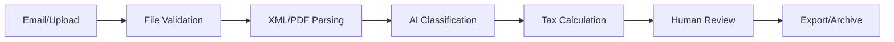

# CFO AI - Automated Invoice Processing for Colombian SMEs


## 🚀 Overview

CFO AI is a comprehensive SaaS platform that automates invoice processing for Colombian Small and Medium Enterprises (SMEs). The platform leverages AI-powered document classification, automatic Colombian tax calculations, and seamless integration with popular accounting systems like Siigo, World Office, and SAP.

### Key Features

- 📧 **Automated Email Processing**: Connect Outlook to automatically process invoice attachments
- 🤖 **AI-Powered Classification**: OpenAI GPT-4 powered document analysis and categorization
- 🇨🇴 **Colombian Tax Compliance**: Complete tax calculations for IVA, ReteFuente, ReteIVA, and ICA
- 👥 **Multi-tenant Architecture**: Secure tenant isolation with role-based access control
- 📊 **Comprehensive Dashboard**: Real-time processing metrics and business insights
- 🔄 **Export Integration**: Direct export to Siigo, World Office, and SAP formats
- ✅ **Review & Approval**: Human-in-the-loop workflow for quality assurance

## 🏗️ Architecture

### Tech Stack

- **Frontend**: Next.js 15+ with App Router, TypeScript, Tailwind CSS, shadcn/ui
- **Backend**: Next.js API Routes, Supabase PostgreSQL, Row Level Security (RLS)
- **AI/ML**: OpenAI GPT-4 for classification, OpenAI Vision for OCR
- **Integrations**: Microsoft Graph API, Supabase Storage, Vercel Analytics
- **Testing**: Jest, Playwright, React Testing Library
- **Deployment**: Vercel, GitHub Actions CI/CD

### Project Structure

```
CFOAI/
├── apps/
│   └── web/                    # Next.js application
│       ├── app/               # App router pages
│       ├── components/        # React components
│       ├── lib/              # Business logic and utilities
│       │   ├── parsers/      # XML/PDF parsing
│       │   ├── tax/          # Colombian tax calculations
│       │   ├── exports/      # Export templates
│       │   └── microsoft/    # Graph API integration
│       └── __tests__/        # Test files
├── claude/
│   └── init/                 # Context engineering documentation
├── supabase/
│   ├── migrations/          # Database migrations
│   └── seed/               # Sample data
└── docs/                   # Additional documentation
```

## 🌍 Colombian Tax Compliance

CFO AI is specifically designed for Colombian tax regulations:

### Supported Tax Types

- **IVA (VAT)**: 19% standard, 5% reduced, 0% zero-rated, exempt categories
- **ReteFuente**: 4% services, 11% professional fees, 2.5% rent
- **ReteIVA**: 15% of IVA amount for retention agents
- **ICA**: Municipal tax rates for Bogotá, Medellín, Cali, and other cities

### Document Formats

- **UBL DIAN**: Colombian electronic invoice standard (XML)
- **PDF OCR**: Scanned invoice processing with OpenAI Vision
- **Export Formats**: Siigo CSV, World Office JSON, SAP XML

## 📊 Features Deep Dive

### 1. Document Processing Pipeline



### 2. Multi-tenant Security

- Row Level Security (RLS) policies
- JWT-based authentication with Supabase Auth
- Role-based permissions (Admin, Accountant, Viewer)
- Audit logging for all operations

### 3. Colombian Tax Engine

Comprehensive tax calculation engine supporting:

- Large taxpayer identification
- City-specific ICA rates
- Activity-based tax categories
- Threshold validation
- Historical rate support

## Getting Started

### Prerequisites

- Node.js 18+
- pnpm 8+
- Supabase project
- OpenAI API key
- Microsoft Azure App Registration (for Outlook)

### Installation

1. **Clone the repository**
   ```bash
   git clone https://github.com/TDXCORE/CFOAI.git
   cd CFOAI
   ```

2. **Install dependencies**
   ```bash
   pnpm install
   ```

3. **Environment setup**
   ```bash
   cp .env.example .env.local
   # Fill in your environment variables
   ```

4. **Database setup**
   ```bash
   # Initialize Supabase (if using local development)
   supabase start
   supabase db reset
   ```

5. **Start development server**
   ```bash
   pnpm dev
   ```

Visit `http://localhost:3000` to see the application.

## 🧪 Testing

### Running Tests

```bash
# Unit tests
pnpm test

# E2E tests
pnpm test:e2e

# Coverage report
pnpm test:coverage
```

### Test Coverage

- **Unit Tests**: >80% coverage target
- **Integration Tests**: API endpoints and database operations
- **E2E Tests**: Critical user workflows with Playwright

## Project Structure

The project is organized into the following folders:

```
apps/
├── web/                  # Next.js application
│   ├── app/             # App Router pages
│   │   ├── (marketing)/ # Public marketing pages
│   │   ├── auth/        # Authentication pages
│   │   └── home/        # Protected app pages
│   ├── supabase/        # Database & migrations
│   └── config/          # App configuration
│
packages/
├── ui/                  # Shared UI components
└── features/           # Core feature packages
    ├── auth/           # Authentication logic
    └── ...
```

For more information about this project structure, see the article [Next.js App Router: Project Structure](https://makerkit.dev/blog/tutorials/nextjs-app-router-project-structure).

### Environment Variables

You can configure the application by setting environment variables in the `.env.local` file.

Here are the available variables:

| Variable Name | Description | Default Value |
| --- | --- | --- |
| `NEXT_PUBLIC_SITE_URL` | The URL of your SaaS application | `http://localhost:3000` |
| `NEXT_PUBLIC_PRODUCT_NAME` | The name of your SaaS product | `Makerkit` |
| `NEXT_PUBLIC_SITE_TITLE` | The title of your SaaS product | `Makerkit - The easiest way to build and manage your SaaS` |
| `NEXT_PUBLIC_SITE_DESCRIPTION` | The description of your SaaS product | `Makerkit is the easiest way to build and manage your SaaS. It provides you with the tools you need to build your SaaS, without the hassle of building it from scratch.` |
| `NEXT_PUBLIC_DEFAULT_THEME_MODE` | The default theme mode of your SaaS product | `light` |
| `NEXT_PUBLIC_THEME_COLOR` | The default theme color of your SaaS product | `#ffffff` |
| `NEXT_PUBLIC_THEME_COLOR_DARK` | The default theme color of your SaaS product in dark mode | `#0a0a0a` |
| `NEXT_PUBLIC_SUPABASE_URL` | The URL of your Supabase project | `http://127.0.0.1:54321` |
| `NEXT_PUBLIC_SUPABASE_ANON_KEY` | The anon key of your Supabase project | ''
| `SUPABASE_SERVICE_ROLE_KEY` | The service role key of your Supabase project | ''

## Architecture

This starter kit uses a monorepo architecture.

1. The `apps/web` directory is the Next.js application.
2. The `packages` directory contains all the packages used by the application.
3. The `packages/features` directory contains all the features of the application.
4. The `packages/ui` directory contains all the UI components.

For more information about the architecture, please refer to the [Makerkit blog post about Next.js Project Structure](https://makerkit.dev/blog/tutorials/nextjs-app-router-project-structure).

### Marketing Pages

Marketing pages are located in the `apps/web/app/(marketing)` directory. These pages are used to showcase the features of the SaaS and provide information about the product.

### Authentication

Authenticated is backed by Supabase. The `apps/web/app/auth` directory contains the authentication pages, however, the logic is into its own package `@kit/auth` located in `packages/features/auth`.

This package can be used across multiple applications.

### Gated Pages

Gated pages are located in the `apps/web/app/home` directory. Here is where you can build your SaaS pages that are gated by authentication.

### Database

The Supabase database is located in the `apps/web/supabase` directory. In this directory you will find the database schema, migrations, and seed data.

#### Creating a new migration
To create a new migration, run the following command:

```bash
pnpm --filter web supabase migration new --name <migration-name>
```

This command will create a new migration file in the `apps/web/supabase/migrations` directory. 

#### Applying a migration

Once you have created a migration, you can apply it to the database by running the following command:

```bash
pnpm run supabase:web:reset
```

This command will apply the migration to the database and update the schema. It will also reset the database using the provided seed data.

#### Linking the Supabase database

Linking the local Supabase database to the Supabase project is done by running the following command:

```bash
pnpm --filter web supabase db link
```

This command will link the local Supabase database to the Supabase project.

#### Pushing the migration to the Supabase project

After you have made changes to the migration, you can push the migration to the Supabase project by running the following command:

```bash
pnpm --filter web supabase db push
```

This command will push the migration to the Supabase project. You can now apply the migration to the Supabase database.

## Going to Production

#### 1. Create a Supabase project

To deploy your application to production, you will need to create a Supabase project.

#### 2. Push the migration to the Supabase project

After you have made changes to the migration, you can push the migration to the Supabase project by running the following command:

```bash
pnpm --filter web supabase db push
```

This command will push the migration to the Supabase project.

#### 3. Set the Supabase Callback URL

When working with a remote Supabase project, you will need to set the Supabase Callback URL.

Please set the callback URL in the Supabase project settings to the following URL:

`<url>/auth/callback`

Where `<url>` is the URL of your application.

#### 4. Deploy to Vercel or any other hosting provider

You can deploy your application to any hosting provider that supports Next.js.

#### 5. Deploy to Cloudflare

The configuration should work as is, but you need to set the runtime to `edge` in the root layout file (`apps/web/app/layout.tsx`).

```tsx
export const runtime = 'edge';
```

Remember to enable Node.js compatibility in the Cloudflare dashboard.

## 🚀 Deployment

### Vercel Deployment

1. **Fork and connect to Vercel**
   - Connect your GitHub repository to Vercel
   - Configure environment variables in Vercel dashboard

2. **Environment Variables**
   - Copy values from `.env.example`
   - Set production URLs and keys
   - Configure Microsoft App Registration for production

3. **Database Migration**
   ```bash
   supabase db push --db-url your-production-db-url
   ```

### GitHub Actions

The repository includes CI/CD pipeline with:

- Automated testing and linting
- Security audit scanning  
- Vercel deployment on main branch
- Database migrations
- Optional E2E test runs

## 📖 Documentation

- [Database Schema](./claude/init/database_schema.sql)
- [Deployment Guide](./DEPLOYMENT.md)
- [Work Plan](./claude/init/work_plan.md)
- [Colombian Tax Rules](./docs/colombian-tax-guide.md)

## 🤝 Contributing

We welcome contributions! Please see our [Contributing Guide](./CONTRIBUTING.md) for details.

### Development Workflow

1. Fork the repository
2. Create a feature branch (`git checkout -b feature/amazing-feature`)
3. Commit your changes (`git commit -m 'Add amazing feature'`)
4. Push to the branch (`git push origin feature/amazing-feature`)
5. Open a Pull Request

## 📄 License

This project is licensed under the MIT License - see the [LICENSE](./LICENSE) file for details.

## 🆘 Support

- 📧 Email: support@cfoai.co
- 📚 Documentation: [docs.cfoai.co](https://docs.cfoai.co)
- 🐛 Issues: [GitHub Issues](https://github.com/TDXCORE/CFOAI/issues)

## 🎯 Success Metrics

### Technical KPIs
- 99.5% uptime SLA
- <10 minute average processing time
- <2 second API response time (95th percentile)
- 95%+ document processing accuracy

### Business KPIs
- Process 1,800+ invoices/month per tenant
- 40%+ reduction in manual processing time
- 90%+ user satisfaction score
- <5% error rate requiring manual correction

## 🗺️ Roadmap

### Phase 1: MVP (Completed ✅)
- Multi-tenant authentication
- Document processing pipeline
- Colombian tax calculations
- Microsoft Outlook integration
- Export functionality

### Phase 2: Enhanced Features (Q2 2024)
- CFO AI chat interface
- Advanced analytics dashboard
- Mobile application
- WhatsApp integration
- Multi-country support

### Phase 3: Enterprise (Q3-Q4 2024)
- Advanced workflow automation
- Custom integrations API
- White-label solutions
- Advanced security features
- Compliance certifications

---

Made with ❤️ for Colombian SMEs by the CFO AI Team
